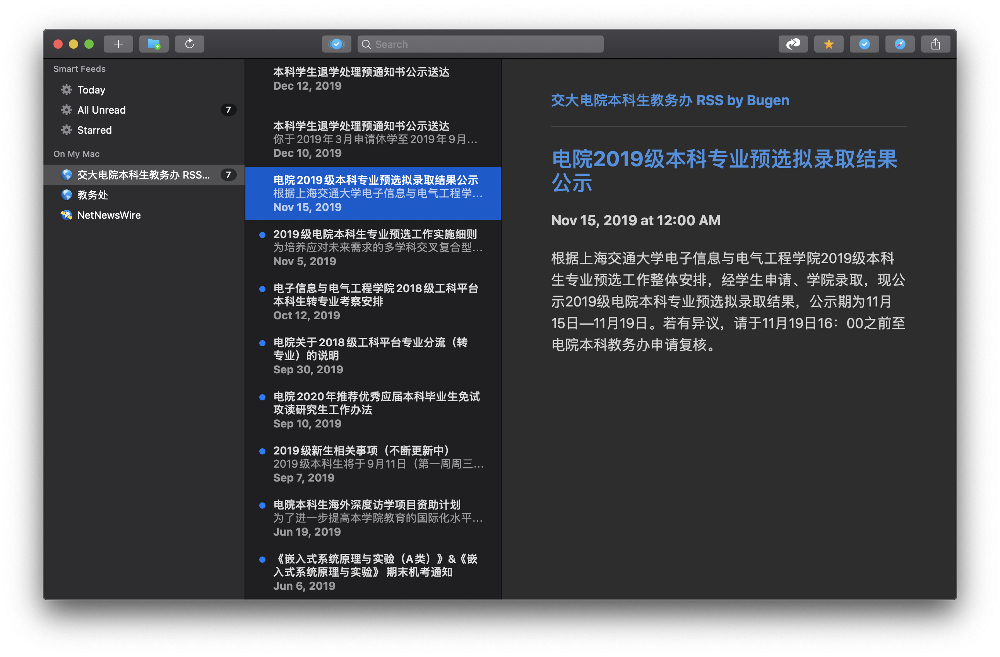

# PyFeed
A simple RSS feed implemented in Python, for Office of Undergraduate Affairs, SEIEE, SJTU.

## Feed on bugenzhao.com

You can get a existing feed for **Office of Undergraduate Affairs, SEIEE, SJTU** at:

> https://bugenzhao.com/rss.xml

Subscribe it with [NetNewsWire](https://ranchero.com/netnewswire/), a fully free RSS reader for macOS and iOS.



## Self Hosting

If you want to host your own feed, follow the instructions below:

1. Clone the repository and install requirements.

   ```bash
   git clone https://github.com/BugenZhao/PyFeed
   cd PyFeed
   pip3 install -r requirements.txt
   ```

2. Configure `config.json` like this:

   ```json
   {
     "version": "v0.2",
     "time_interval": 900,  
     "box_path": "./box.p",
     "rss_path": "/root/homepage/public/rss.xml"
   }
   ```

   | Key           | Description                                 |
   | ------------- | ------------------------------------------- |
   | time_interval | Time interval for update                    |
   | box_path      | Path for app to save and load current state |
   | rss_path      | Path of the feed to generate                |

3. Go for it!

   ```bash
   python3 ./main.py
   ```


